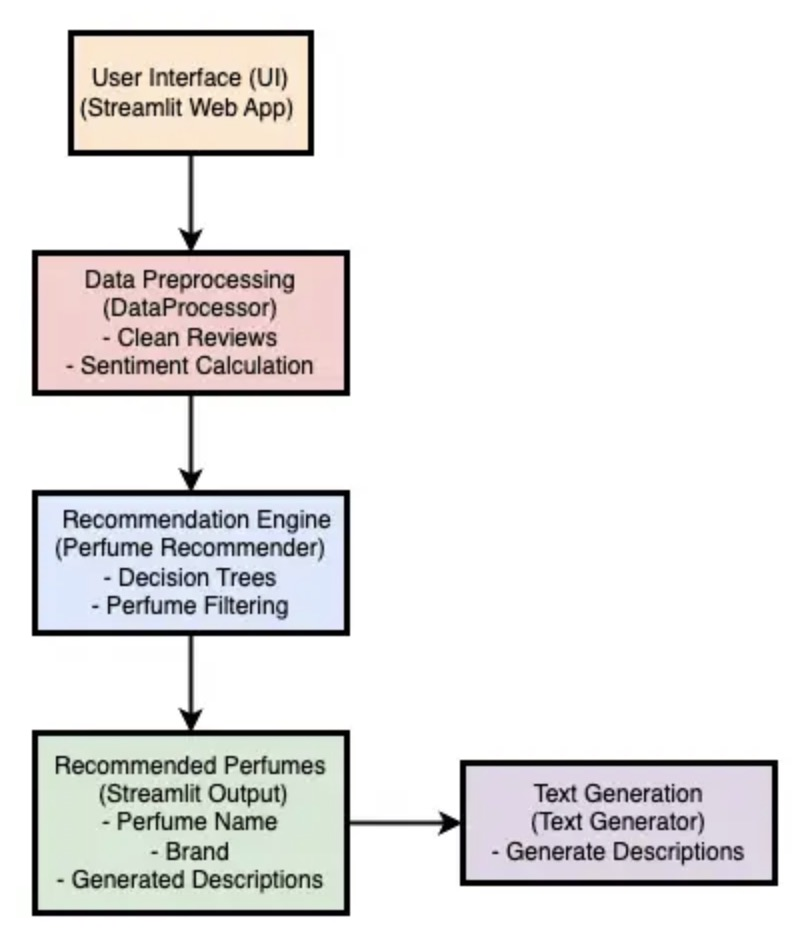

# **Perfume Recommender & Custom Description Generator**  

This project is an end-to-end **NLP-powered perfume recommendation system** that integrates **sentiment analysis**, **decision tree-based recommendation**, and **custom text generation** using **GPT-2**. Users can interact with the system through a web interface built using **Streamlit**.

---

## **Table of Contents**  

1. [Project Overview](#project-overview) 
2. [Team Members](#team-members)
3. [Features](#features)  
4. [Technologies Used](#technologies-used)  
5. [Installation](#installation)  
6. [Usage](#usage)  
7. [How It Works](#how-it-works)  
8. [Project Structure](#project-structure)  
9. [Future Enhancements](#future-enhancements)  
10. [License](#license)  

---

## **Project Overview**  

This project recommends perfumes based on user-selected attributes such as **main accords** and **sentiment scores**. It also generates custom descriptions using a **fine-tuned GPT-2 language model**. The system combines **NLP techniques** like **text preprocessing**, **sentiment analysis**, **decision tree modeling**, and **text generation** into a unified pipeline.

---

## **Team Members**

* Kexin Lyu
* Fangzhou Wang
* Shuyu Meng

---

## **Features**  

✔️ **Interactive User Input:**  
Users can choose main accords, detailed accords, and apply sentiment score filters.  

✔️ **Sentiment Analysis:**  
User reviews are analyzed to calculate sentiment scores using **VADER**.  

✔️ **Decision Tree-Based Recommendations:**  
Predicts the next likely main accords and recommends relevant perfumes.  

✔️ **Custom Description Generation:**  
Generates unique perfume descriptions using a **GPT-2** model.  

✔️ **Web Interface:**  
A clean and interactive interface built using **Streamlit**.  

---

## **Technologies Used**  

- **Programming Language:** Python 3.9+  
- **Libraries:**  
  - **NLP:** Transformers (Fine-tuned GPT-2), NLTK (VADER)  
  - **Machine Learning:** scikit-learn (DecisionTreeClassifier)  
  - **Web Framework:** Streamlit  
  - **Data Handling:** Pandas  
- **Environment Management:** Conda  
- **Code Quality:** Pylint, Black, Ruff  

---

## **Installation**  

1. **Clone the repository:**  

   git clone https://github.com/fangzhou-wang/dsan5400-Final-PerfumeGenerator
   cd perfume-recommender


2. **Create a Conda environment using the provided environment file:**  

   conda env create -f environment.yml
   conda activate perfume-recommender


3. **Download necessary resources:**  

   python -m nltk.downloader vader_lexicon

---

## **Usage**  

1. **Run the Streamlit web application:**  

   streamlit run website_generation.py


2. **Interact with the web app:**  

   - Select up to 5 main accords.
   - Choose a sentiment score threshold to filter recommendations.
   - View the list of recommended perfumes.
   - Read custom-generated descriptions for the perfumes.  

---

## **How It Works**  


### **1. Data Preprocessing**

- Data Cleaning:
Perfume descriptions and user reviews are cleaned to remove unnecessary characters, spaces, and formatting.
Text is normalized for consistent processing (e.g., lowercasing, removing special characters).

- Sentiment Analysis:
Sentiment scores are calculated for each review using the VADER sentiment analysis tool.
The sentiment scores are aggregated by perfume name to generate the Average Sentiment Score.

- Data Format Preparation:
The user review data is preprocessed and converted into JSONL format for fine-tuning the GPT-2 model.

### **2. Recommendation Engine**

- Filtering Logic:
Users select main accords and a sentiment threshold via the Streamlit interface.
The engine filters perfumes based on the selected criteria, including:
Main Accords: Top 5 main accords chosen by the user.

- Sentiment Threshold: Filters perfumes with an average sentiment score above the chosen value.

- Decision Tree Models:
Machine learning-based Decision Tree models predict the next possible main accords based on existing data and trends. This enhances the recommendation process by suggesting perfumes aligned with user preferences.

### **3. Text Generation**

- Fine-Tuned GPT-2 Model:
A GPT-2 model is fine-tuned on a perfume review dataset to generate personalized and context-aware descriptions.

Prompts such as "Describe the perfume: [Perfume Name]" are used to guide the model in generating coherent outputs.

- Training Details:
Input/Output Format: Combines perfume names (as prompts) and reviews (as completions).

Training library: Hugging Face Transformers library.

Result: A custom fine-tuned GPT-2 model that improves upon the generic GPT-2 by focusing specifically on perfume-related content.

Generated Output:
Descriptions include key attributes, accords, and user-friendly language tailored to the selected perfumes.

### **4. User Interaction**

- Streamlit Interface:
A user-friendly interface built with Streamlit collects user input, including main accords and sentiment thresholds.

- Displays the following:
Recommended Perfumes: A table of perfumes filtered by the engine.

Generated Descriptions: Personalized descriptions for each recommended perfume.

Input Options:
Select up to 5 main accords.
Adjust the sentiment score threshold with an interactive slider.

Output Display:
Clean, structured tables for recommendations.
Descriptive text generated by the GPT-2 model, providing users with insights into the recommended perfumes.

## How to Run the Website

Follow these steps to set up and run the Perfume Recommender and Description Generator locally:

### **1. Prerequisites**
Make sure the following dependencies are installed:

```python
Python 3.8+
Conda or virtual environment manager (optional but recommended)
```

Required libraries:
```python
pip install streamlit transformers torch datasets nltk pandas scikit-learn
```

### **2. Clone the Repository**

Download or clone the repository to your local machine:

git clone https://github.com/fangzhou-wang/dsan5400-Final-PerfumeGenerator.git

### **3. Fine-Tune GPT-2 (Optional)**

If you want to fine-tune the GPT-2 model again, follow these steps:

Preprocess the data:
```python
python perfume_recommender/text_generation/preprocess_data.py
```

Fine-tune GPT-2:
```python
python perfume_recommender/text_generation/fine_tune_gpt2.py
```
The fine-tuned model will be saved to the specified directory (e.g., fine_tuned_gpt2_perfume).

### **4. Run the Streamlit Application**

Launch the Streamlit app using the following command:

```python
streamlit run website_generation.py
```

5. ### **View the Website**
Once the app runs successfully, you will see the following output in your terminal:

You can now view your Streamlit app in your browser.

Local URL: http://localhost:8501
Network URL: http://<your-ip>:8501

Open the Local URL in your browser to interact with the application.
Adjust the user inputs to get personalized recommendations and generated descriptions.

---

## **Project Structure**  

```
.
├── README.md
├── environment.yml
├── perfume_recommender
│   ├── data
│   │   └── fra_cleaned.csv
│   ├── perfume_recommender
│   │   ├── __init__.py
│   │   ├── data_processing
│   │   │   ├── __init__.py
│   │   │   └── data_processing.py
│   │   ├── perfume_recommendation
│   │   │   ├── __init__.py
│   │   │   └── perfume_recommendation.py
│   │   ├── text_generation
│   │   │   ├── __init__.py
│   │   │   ├── fine_tune_gpt2.py   # fine tune GPT2 model
│   │   │   ├── precess_reviews.py  # convert CSV file of perfume reviews to JSONL
│   │   │   └── text_generation.py
            
│   │   └── website_generation.py
│   └── tests
│       ├── __init__.py
│       ├── sample_perfume_data.csv
│       ├── sample_review_data.csv
│       ├── test_data_processing.py
│       ├── test_perfume_recommendation.py
│       └── test_text_generation.py
├── fine-tuned-gpt2_perfume   #used to fine tune perfume description  GPT2 model
│   ├── checkpoint-642/                # Intermediate checkpoint at step 642
│   ├── checkpoint-963/                # Final checkpoint at step 963
│   ├── config.json                    # Model configuration file
│   ├── generation_config.json         # Generation-specific configuration
│   ├── merges.txt                     # Byte Pair Encoding (BPE) merges for tokenizer
│   ├── model.safetensors              # Final trained model weights in safetensors format
│   ├── special_tokens_map.json        # Mapping of special tokens (e.g., <PAD>, <EOS>)
│   ├── tokenizer_config.json          # Tokenizer configuration file
│   ├── vocab.json                     # Vocabulary for GPT-2 tokenizer
└── pyproject.toml

```

---

## Project Architecture



## **pytest results

### Test for perfume recommender

(base) boatwang@WinnieMacBook-Air nb % pytest tests/ ==================================== test session starts ===================================== platform darwin -- Python 3.12.4, pytest-7.4.4, pluggy-1.0.0 rootdir: /Users/boatwang//DSAN5400-Final-PerfumeGenerator/perfume_recommender
configfile: pytest.ini plugins: anyio-4.2.0 collected 3 items

tests/test_perfume_recommendation.py ... [100%]

===================================== 2 passed in 0.76s ======================================


### Test for text generation

(base) boatwang@WinnieMacBook-Air nb % pytest tests/ ==================================== test session starts ===================================== platform darwin -- Python 3.12.4, pytest-7.4.4, pluggy-1.0.0 rootdir: /Users/boatwang//DSAN5400-Final-PerfumeGenerator/perfume_recommender
configfile: pytest.ini plugins: anyio-4.2.0 collected 3 items

tests/test_text_generation.py ... [100%]

===================================== 1 passed in 0.76s ======================================


## **Current Limitations**

### While the fine-tuned GPT-2 model performs well in generating perfume descriptions, there are some limitations that users should be aware of:

**Data Quality and Size**:
The model was trained on a limited dataset consisting of perfume reviews. This may lead to biases in the generated descriptions and an inability to generalize well for perfumes not included in the training data.

**Repetitive Outputs**:
Occasionally, the generated descriptions may include repetitive phrases or overly generic content. This issue is common in GPT-2 models, especially with small datasets.

**Lack of Logical Consistency**:
The model sometimes produces sentences that lack logical flow or include contradictory information, such as describing a scent as both "soft" and "overpowering."

**Limited Context Window**:
GPT-2 has a fixed token limit (1024 tokens). If the input prompt is too long, the model may ignore some information, resulting in incomplete or inaccurate outputs.

**Dependence on Input Prompts**:
The quality and creativity of the generated description depend heavily on the input prompt. Poorly structured or ambiguous prompts may lead to less meaningful outputs.

**Evaluation Metrics**:
No formal evaluation metrics like BLEU or ROUGE have been applied to assess the quality of generated outputs. The descriptions are currently evaluated subjectively.


## **Future Enhancements** 

### To overcome the above limitations and enhance the overall functionality and user experience, the following improvements are planned:

🚀 **Enhanced Recommendation Model**
- Incorporate Advanced Techniques: Integrate collaborative filtering, content-based filtering, or neural networks to provide more personalized and accurate perfume recommendations.

- Machine Learning Integration: Train machine learning models to analyze user preferences and recommend perfumes based on past interactions and reviews.

🌍 **Multilingual Support**
- Integrate multilingual models like mT5 or XLM-R to support multiple languages, enabling non-English-speaking users to interact with the system effectively.

📊 **Interactive Data Visualization**

Implement visual dashboards to display:
- Sentiment Trends: Trends in sentiment scores across different perfumes or brands.
- Recommendation Statistics: Visualizations of popular perfumes, user preferences, and input distributions.
- User Summaries: Personalized summaries of user-selected accords, reviews, and generated outputs.

🔮 **Model Improvements**
- Fine-tune larger and more powerful models like GPT-3 or T5 to address issues of logical inconsistency and repetitive outputs.
- Training Dataset Expansion: Incorporate more diverse and high-quality review datasets to improve generalization and reduce biases.
- Evaluation Metrics: Apply quantitative evaluation methods (e.g., BLEU, ROUGE, perplexity) to measure and improve output quality systematically.

💬 **Voice Interaction**
- Integrate voice input/output capabilities using tools like SpeechRecognition and gTTS to provide a hands-free, accessible experience for users.

🤝 **User Feedback Mechanism**
- Allow users to rate generated descriptions and recommendations, enabling the system to improve over time through reinforcement learning or fine-tuning based on feedback.

🔧 **Truncation and Padding Enhancements**
- Implement better input/output truncation and padding strategies to handle longer prompts and ensure all inputs fit within the model's context window.

🔮 **Enhanced Recommendation Model:** Incorporate advanced recommendation techniques like collaborative filtering or neural networks. 

🌍 **Multilingual Support:** Support multiple languages using multilingual models like mT5 or XLM-R.  

📊 **Data Visualization:** Include visualizations to display sentiment trends, recommendation statistics, and user input summaries.  

💬 **Voice Interaction:** Integrate voice input/output for a hands-free user experience.

---

## **License**  

This project is licensed under the MIT License. See `LICENSE` for more details.  

---

**Happy Exploring! 🚀**  
For contributions, feel free to fork the project and submit a pull request. 